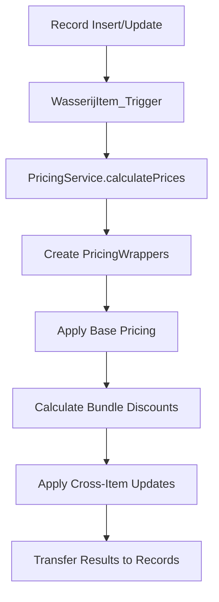

# 🏷️ Salesforce Pricing Engine

Een geavanceerde, metadata-gedreven pricing engine voor Salesforce die automatische prijsberekening en kortingslogic biedt voor wasserij services.

## 📋 Overzicht

De Salesforce Pricing Engine is een complete oplossing voor het beheren van complexe prijsstructuren in een wasserijomgeving. Het systeem ondersteunt:

- **Automatische prijsberekening** gebaseerd op product eigenschappen
- **Bundle kortingen** voor meerdere items in één bestelling  
- **Segment-specifieke prijsregels** (Wasserij, Lead Products, Opportunity Line Items)
- **Metadata-gedreven configuratie** zonder code changes
- **Marketing badges voor extras** via `Product2.Extra_Badge__c`
- **DLRS-compatible processing** om trigger conflicts te voorkomen

## 🏗️ Architectuur

### Core Components

#### 1. **PricingService.cls** - Centrale Pricing Engine
De hoofdklasse die alle prijsberekeningen coördineert:

```apex
// Hoofd entry points
PricingService.calculatePricesForLeadProducts(leads)     // Voor Lead_Product__c
PricingService.calculatePricesForWasserijItems(items)    // Voor Wasserij_Item__c  
PricingService.calculatePricesForOpportunityLineItems(oli) // Voor OpportunityLineItem
PricingService.recalculatePricesAfterDeletion(deletedItems) // Na verwijdering
```

**Key Features:**
- **Wrapper Pattern**: Gebruikt `PricingWrapper` voor unified processing
- **Bundle Discount Logic**: Automatische kortingen gebaseerd op aantal items
- **Cross-Item Updates**: Herberekening van alle items bij wijzigingen
- **Async Processing**: DLRS-compatible deletion recalculation

#### 2. **Bundle_Discount__mdt** - Metadata Configuration
Custom Metadata Type voor configureerbare kortingsregels:

| Field | Type | Beschrijving |
|-------|------|-------------|
| `Min_Count__c` | Number | Minimum aantal items voor korting |
| `Discount_Percent__c` | Number | Kortingspercentage (0.1 = 10%) |
| `Segment__c` | Text | Productsegment (Wasserij, etc.) |
| `Min_Aantal_Threshold__c` | Number | Minimum oppervlakte threshold |
| `Active__c` | Checkbox | Of regel actief is |

**Voorbeeld configuratie:**
```
Segment: Wasserij
Min_Count: 2, Discount: 5% (bij 2+ items)
Min_Count: 3, Discount: 10% (bij 3+ items)  
Min_Count: 5, Discount: 15% (bij 5+ items)
```

#### 3. **Triggers & Guards**
- **WasserijItem_Trigger**: Before/After trigger voor Wasserij_Item__c
- **TriggerRecursionGuard**: Voorkomt infinite trigger loops
- **WasserijItemUpdateQueueable**: Async processing voor DLRS compatibility

#### 4. **Supporting Classes**
- **OpportunityLineItem_Pricing_Test**: Test coverage voor OLI pricing
- **PricingService_Test**: Comprehensive test suite
- **RecalculateLeadTotals_Queueable**: Async lead totals recalculation

## 🔄 Pricing Flow

### 1. **Insert/Update Flow**


### 2. **Deletion Flow (DLRS-Compatible)**
```mermaid
graph TD
    A[Record Deletion] --> B[WasserijItem_Trigger After Delete]
    B --> C[PricingService.recalculatePricesAfterDeletion]
    C --> D[Find Remaining Items]
    D --> E[Recalculate Pricing]
    E --> F[Enqueue Async Update]
    F --> G[WasserijItemUpdateQueueable]
    G --> H[Update Records (No DLRS Conflict)]
```

## 💰 Pricing Logic

### Base Pricing
1. **Product Lookup**: Zoek `Prijsmanagement__c` record voor product
2. **Price Calculation**: `Eenheidsprijs__c * Aantal__c`
3. **Surface Calculation**: Voor vloerkleden: `Lengte__c * Breedte__c / 10000`

### Bundle Discounts
1. **Group by Work Order**: Items worden gegroepeerd per `Werk_Order__c`
2. **Count Qualifying Items**: Tel items > threshold oppervlakte
3. **Apply Highest Discount**: Gebruik hoogste korting waar items voor kwalificeren
4. **Cross-Item Application**: Alle items in work order krijgen zelfde korting

### Korting Berekening
```apex
// Basis prijs (zonder korting)
Totale_Prijs__c = Aantal__c * Verkoopprijs__c

// Kortingsbedrag 
Korting_bedrag__c = Totale_Prijs__c * (Korting__c / 100)

// Eindprijs (via formula field)
Totaal__c = Totale_Prijs__c - Korting_bedrag__c
```

## 🛠️ Configuratie

### Bundle Discount Setup
1. Ga naar **Setup > Custom Metadata Types**
2. Beheer **Bundle Discount** records
3. Configureer per segment:
   - Minimum aantal items
   - Kortingspercentage  
   - Oppervlakte threshold
   - Actief status

### Product Configuration
1. **Product2**: Configureer `Segment__c` field
    - **Extra_Badge__c** *(optioneel)*: korte marketingbadge zoals "Meest gekozen"
2. **Prijsmanagement__c**: Stel prijsregels in per product
   - `Eenheidsprijs__c`: Basis prijs per eenheid
   - `Geldig_vanaf__c` / `Geldig_tot__c`: Geldigheidsdatums

### SR (Spot Reinigen) - Percentage-Based Extras 🆕

De SR segment ondersteunt **percentage-based pricing** voor extras via `Relatieve_prijs__c`:

#### Pricing Types
| Type | Field | Example | Use Case |
|------|-------|---------|----------|
| **Absolute** | `Eenheidsprijs__c` | €50 | Primary products, vaste prijzen |
| **Percentage** | `Relatieve_prijs__c` | 10% | SR extras (schaalt met base price) |

#### SR Extra Configuration

**Prijsmanagement__c Setup**:
```apex
// Voor percentage-based extras
Relatieve_prijs__c: 10    // 10% of base product price
Eenheidsprijs__c: null    // MUST be null, not €0
Actief__c: true
Geldig_vanaf__c: TODAY
```

**Product2 Requirements**:
- `Gerelateerd_hoofdproduct__c`: Must point to primary SR product
- `Primaryproduct__c`: false (extras are not primary)
- `Segment__c`: 'SR'
- `Extra_Badge__c` *(optioneel)*: toon een badge in WordPress (bijv. "Aanbevolen bij huisdieren")

**Example Products**:
- `SR-EXTRA-MEUBEL-VEZEL` (10%): Vezelbeschermer  
- `SR-EXTRA-MEUBEL-GEUR` (10%): Ontgeuren overig
- `SR-EXTRA-MEUBEL-URINE` (15%): Ontgeuren urine
- `SR-EXTRA-TAPIJT-VEZEL` (10%): Tapijt vezelbeschermer
- `SR-EXTRA-TAPIJT-GEUR` (10%): Tapijt ontgeuren overig
- `SR-EXTRA-TAPIJT-URINE` (15%): Tapijt ontgeuren urine

#### Calculation Logic
```apex
// API returns percentage-based extras
ResponseProduct extra = new ResponseProduct();
extra.percentageOfBase = 10;  // 10%
extra.pricingType = 'percentage';
extra.basePrice = null;

// WordPress calculates dynamically
basePriceTotal = prijsPerSeat * seats;  // €50 * 3 = €150
extraPrice = basePriceTotal * (percentageOfBase / 100);  // €150 * 0.10 = €15
```

#### Configuration Scripts
```powershell
# Configure SR extras (creates Prijsmanagement__c + parent relationships)
sf apex run --file scripts/apex/configure_sr_extras_percentage.apex

# Verify configuration
sf apex run --file scripts/apex/test_sr_percentage_extras.apex
```

**Documentation**: See [SR-EXTRAS-PERCENTAGE-CONFIGURATION.md](SR-EXTRAS-PERCENTAGE-CONFIGURATION.md)

## 🧪 Testing & Debugging

### Utility Test Scripts
```
scripts/apex/
├── check_bundle_metadata.apex         # Bundle discount metadata verification
├── functional_test_lead_product.apex  # Lead_Product__c pricing test
└── check_recursion_guard.apex         # Recursion guard status check
```

**Removed Debug Scripts** (archived):
- `deep_diagnose_pricing.apex` - One-time debug session (v7.2.0)
- `final_dlrs_test.apex` - DLRS compatibility verified (stable)
- `comprehensive_deletion_test.apex` - Deletion flow tested (working)

### Running Tests
```powershell
# Authenticate to org
sf org login web --alias myorg

# Run utility scripts
sf apex run --file scripts/apex/check_bundle_metadata.apex
sf apex run --file scripts/apex/functional_test_lead_product.apex

# Run test classes
sf apex run test --class-names PricingService_Test --result-format human
sf apex run test --class-names OpportunityLineItem_Pricing_Test --result-format human
```

---

## 🎁 Bundle Discount Implementation

### Architecture
Het bundle discount systeem is **volledig metadata-gedreven**:

1. **Configuration**: `Bundle_Discount__mdt` custom metadata
2. **API Integration**: `PriceCalculationApi.cls` returneerd rules naar WordPress
3. **Frontend Calculation**: WordPress berekent korting in real-time
4. **Backend Validation**: Salesforce herberekent bij Lead creation

### Metadata Fields
```apex
Bundle_Discount__mdt:
- Label: "Rug 2 Items – 5%"
- Min_Count__c: 2
- Discount_Percent__c: 5
- Segment__c: "Wasserij"
- Min_Aantal_Threshold__c: 0.5  // Minimum 0.5m² oppervlakte
- Active__c: true
```

### Eligibility Rules
Een item komt in aanmerking voor bundelkorting als:
1. Product heeft `Bundelkorting_toepasbaar__c = true`
2. Item oppervlakte >= `Min_Aantal_Threshold__c` (default 0.5m²)
3. Item is primary product (geen extra)
4. Totaal aantal eligible items >= `Min_Count__c`

### Example Flow
```apex
// Wasserij segment met 3 vloerkleden:
Item 1: 2.0m² (✅ eligible)
Item 2: 1.5m² (✅ eligible)
Item 3: 0.3m² (❌ too small)

// Result: 2 eligible items → 5% korting
// Alle 3 items krijgen 5% korting (ook item 3)
```

---

## 🌍 Regional Surcharge (Regiotoeslag)

### Implementation
Regiotoeslag wordt bepaald via `Postcodegebied__c` object:

```apex
PriceCalculationApi.cls:
1. Lookup Postcodegebied__c via postcode
2. Read Regiotoeslag_Percentage__c field (e.g., 25)
3. Return to WordPress in catalog response
4. WordPress applies surcharge in frontend pricing
```

### Data Model
```
Postcodegebied__c:
- Postcode__c: "1012"
- Gebied__c: "Amsterdam Centrum"
- Regiotoeslag_Percentage__c: 25
- Partner__c: [Lookup to Account]
- Dienstgebied__c: [Lookup to Dienstgebied__c]
```

### Pricing Calculation
```javascript
// WordPress frontend
const basePrice = 100.00;
const regioToeslag = 25; // From Salesforce
const finalPrice = basePrice * (1 + regioToeslag / 100); // €125.00
```

### Salesforce Backend
```apex
// PriceCalculationApi.cls - getRegioToeslagPercentage()
String postcode = extractPostcodeDigits(postcodeInput); // "1012AB" → "1012"
String soql = 'SELECT Regiotoeslag_Percentage__c FROM Postcodegebied__c WHERE Postcode__c = :postcode';
List<Postcodegebied__c> results = Database.query(soql);
Decimal percentage = results.isEmpty() ? 0 : results[0].Regiotoeslag_Percentage__c;
```

---

## 🔗 WordPress Integration

### REST API Endpoint
**URL**: `/services/apexrest/v1/calculatePrice`  
**Method**: POST  
**Auth**: OAuth2 (Connected App)

### Request Format
```json
{
    "postcode": "1012AB",
    "segment": "Wasserij",
    "siteId": "CincoCleaning",
    "products": [] // Empty for catalog request
}
```

### Response Format
```json
{
    "success": true,
    "availableProducts": [
        {
            "productCode": "WAS-PRIM-VLOERKLEED-REINIGEN",
            "productName": "Vloerkleed Reinigen",
            "basePrice": 20.00,
            "bundelkortingToepasbaar": true,
            "isPrimary": true
        }
    ],
    "bundleDiscounts": [
        {
            "label": "Rug 2 Items – 5%",
            "minCount": 2,
            "discountPercent": 0.05,
            "segment": "Wasserij",
            "active": true
        }
    ],
    "regioToeslagPercentage": 25,
    "partnerId": "0019X00001CzUMpQAN",
    "postcodeGebiedId": "a2p9X000000dz49QAA",
    "dienstgebiedId": "a2o9X000004fOAXQA2"
}
```

### Lookup IDs Integration
De API returneerd 18-character Salesforce IDs voor:
- **partnerId**: Account (Partner) ID
- **postcodeGebiedId**: Postcodegebied__c ID  
- **dienstgebiedId**: Dienstgebied__c ID (optioneel)

Deze IDs worden:
1. Opgeslagen in WordPress SessionStorage (`cincoMetadata`)
2. Meegezonden bij Lead creation
3. Gepopuleerd in Lead object lookups (Partner__c, Postcodegebied__c)

**Validation**: IDs moeten exact 18 characters zijn, anders worden ze genegeerd met warning log.

---

## 📊 Version History

### v1.5.0 - October 2025 (Current)
**WordPress Integration Complete**
- ✅ PriceCalculationApi fully integrated with WordPress
- ✅ Lookup IDs (Partner__c, Postcodegebied__c) now populated
- ✅ Bundle discounts metadata-driven
- ✅ Regional surcharge calculation
- ✅ Multi-step form support
- ✅ Extra badges voor extras via `Extra_Badge__c`

### v1.4.0 - October 2025
**SR (Spot Reinigen) Implementation**
- ✅ SR Meubel pricing (per seat)
- ✅ SR Tapijt pricing (per m² / per trede)
- ✅ Percentage-based extras (Relatieve_prijs__c)
- ✅ Modern UI components

### v1.3.0 - September 2025
**DLRS Compatibility**
- ✅ TriggerRecursionGuard implemented
- ✅ Async deletion processing (queueable)
- ✅ No more MAX_DEPTH_IN_FLOW_EXECUTION errors

### v1.2.0 - August 2025
**Bundle Discounts**
- ✅ Metadata-driven configuration
- ✅ Cross-item discount application
- ✅ Segment-specific rules

### v1.1.0 - July 2025
**Core Pricing Engine**
- ✅ PricingService orchestrator
- ✅ Wrapper pattern implementation
- ✅ OpportunityLineItem support

---

## 🚀 Deployment Checklist

### Pre-Deployment (Sandbox)
- [ ] Run all test classes (minimum 75% coverage)
- [ ] Verify Bundle_Discount__mdt records exist and are active
- [ ] Test PriceCalculationApi with WordPress (Postman/cURL)
- [ ] Validate lookup IDs return correctly (18 chars)
- [ ] Check recursion guards prevent infinite loops

### Deployment to Production
```powershell
# Deploy metadata
sf project deploy start --source-dir force-app/main/default/ --target-org production

# Run tests in production
sf apex run test --target-org production --result-format human

# Verify deployment
sf project deploy report --target-org production
```

### Post-Deployment Verification
- [ ] Create test Lead via WordPress
- [ ] Verify Lead.Partner__c and Lead.Postcodegebied__c populated
- [ ] Check Lead_Product__c pricing calculations
- [ ] Validate bundle discounts apply correctly
- [ ] Monitor API limits (Setup > System Overview)
- [ ] Check debug logs for errors

---

## 🐛 Troubleshooting

### Debug Commands
```apex
// Check bundle discount metadata
List<Bundle_Discount__mdt> rules = [SELECT Min_Count__c, Discount_Percent__c FROM Bundle_Discount__mdt WHERE Active__c = TRUE];

// Check queueable jobs
List<AsyncApexJob> jobs = [SELECT Status FROM AsyncApexJob WHERE JobType = 'Queueable' AND CreatedDate = TODAY];

// Manual price recalculation  
PricingService.calculatePricesForWasserijItems([SELECT Id FROM Wasserij_Item__c WHERE Werk_Order__c = :workOrderId]);
```

## ⚠️ Belangrijke Overwegingen

### DLRS Compatibility
Het systeem is ontworpen om te werken met **Declarative Lookup Rollup Summary (DLRS)**:
- Deletion recalculation gebruikt **async processing**
- **TriggerRecursionGuards** voorkomen conflicts
- **Queueable jobs** vermijden `MAX_DEPTH_IN_FLOW_EXECUTION` errors

### Performance
- **Bulk processing**: Alle operations ondersteunen bulk data
- **Wrapper pattern**: Minimale SOQL queries  
- **Selective updates**: Alleen gewijzigde fields worden geupdate

### Troubleshooting
**Geen korting toegepast?**
1. Check Bundle_Discount__mdt configuratie
2. Verify Segment__c op Product2
3. Check oppervlakte threshold
4. Verify geldigheidsdata Prijsmanagement__c

**DLRS Errors?**
1. Check AsyncApexJob voor queueable status
2. Verify TriggerRecursionGuard settings
3. Monitor debug logs voor errors

## 🚀 Deployment

### Source Directory Structure
```
force-app/main/default/
├── classes/
│   ├── PricingService.cls
│   ├── TriggerRecursionGuard.cls
│   ├── WasserijItemUpdateQueueable.cls
│   └── [Test Classes]
├── triggers/
│   └── WasserijItem_Trigger.trigger
├── objects/
│   ├── Bundle_Discount__mdt/
│   ├── Wasserij_Item__c/
│   └── Prijsmanagement__c/
└── [Other metadata]
```

### Deployment Commands
```bash
# Deploy to sandbox
sf project deploy start --target-org sandbox

# Deploy to production  
sf project deploy start --target-org prod --test-level RunLocalTests

# Deploy specific class
sf project deploy start --source-dir force-app/main/default/classes/PricingService.cls
```

## 📈 Versie Geschiedenis

### v1.3 - DLRS Compatibility (September 2025)
- ✅ Async deletion recalculation
- ✅ DLRS conflict resolution
- ✅ Enhanced error handling
- ✅ Improved logging

### v1.2 - Bundle Discount Enhancement
- ✅ Cross-item update fix
- ✅ SOQL field error resolution  
- ✅ Metadata-driven configuration

### v1.1 - Multi-Object Support
- ✅ Lead_Product__c support
- ✅ OpportunityLineItem support
- ✅ Wasserij_Item__c core functionality

### v1.0 - Initial Release
- ✅ Basic pricing calculation
- ✅ Bundle discount logic
- ✅ Trigger framework

---

## 💡 Support

Voor vragen of issues, raadpleeg:
1. **Debug logs** in Salesforce Developer Console
2. **Test scripts** in `scripts/apex/` directory  
3. **AsyncApexJob** monitoring voor queueable status
4. **Bundle_Discount__mdt** configuratie verificatie

## 👨‍💻 Developer Best Practices

### 🔒 **Development Guidelines**

#### **Code Modifications**
```apex
// ✅ GOED - Gebruik altijd recursion guards
if (!TriggerRecursionGuard.isRunning('MyOperation')) {
    TriggerRecursionGuard.setRunning('MyOperation');
    try {
        // Your logic here
    } finally {
        TriggerRecursionGuard.setNotRunning('MyOperation');
    }
}

// ❌ SLECHT - Direct database operations zonder guards
update items; // Kan infinite loops veroorzaken
```

#### **Bulk Data Handling**
```apex
// ✅ GOED - Bulk processing support
PricingService.calculatePricesForWasserijItems(List<Wasserij_Item__c> items);

// ❌ SLECHT - Single record processing in loop  
for (Wasserij_Item__c item : items) {
    PricingService.calculatePrices(new List<Wasserij_Item__c>{item});
}
```

#### **DLRS Compatibility**
```apex
// ✅ GOED - Async updates voor deletion recalculation
System.enqueueJob(new WasserijItemUpdateQueueable(items));

// ❌ SLECHT - Synchrone updates in after delete context
update remainingItems; // Kan DLRS conflicts veroorzaken
```

### 🧪 **Testing Best Practices**

#### **Test Data Setup**
```apex
@TestSetup
static void setupTestData() {
    // Gebruik consistent test data patterns
    Product2 testProduct = new Product2(
        Name = 'Test Product',
        ProductCode = 'TEST-001',
        Segment__c = 'Wasserij',
        IsActive = true
    );
    insert testProduct;
    
    // Altijd pricing rules instellen
    Prijsmanagement__c pricing = new Prijsmanagement__c(
        Product__c = testProduct.Id,
        Eenheidsprijs__c = 25.00,
        Geldig_vanaf__c = Date.today().addDays(-1),
        Geldig_tot__c = Date.today().addDays(365)
    );
    insert pricing;
}
```

#### **Bundle Discount Testing**
```apex
// Test verschillende scenario's
@IsTest
static void testBundleDiscounts() {
    // Test 1: Geen korting (1 item)
    // Test 2: Eerste korting tier (2 items)  
    // Test 3: Hogere korting tier (3+ items)
    // Test 4: Cross-item updates
    // Test 5: Deletion recalculation
}
```

#### **Async Testing**
```apex
@IsTest  
static void testAsyncProcessing() {
    // Setup data
    Test.startTest();
    
    // Trigger async operation
    delete testItem;
    
    Test.stopTest(); // Force async completion
    
    // Verify results
    List<AsyncApexJob> jobs = [SELECT Status FROM AsyncApexJob WHERE JobType = 'Queueable'];
    System.assertEquals('Completed', jobs[0].Status);
}
```

### 🛡️ **Error Handling Patterns**

#### **Defensive Programming**
```apex
public static void calculatePrices(List<Wasserij_Item__c> items) {
    // Input validation
    if (items == null || items.isEmpty()) {
        System.debug('No items provided for price calculation');
        return;
    }
    
    try {
        // Main logic
        performCalculations(items);
    } catch (Exception e) {
        // Log en graceful degradation
        System.debug('Price calculation error: ' + e.getMessage());
        System.debug('Stack trace: ' + e.getStackTraceString());
        
        // Fallback logic indien mogelijk
        applyBasicPricing(items);
    }
}
```

#### **SOQL Best Practices**
```apex
// ✅ GOED - Bulk query met alle benodigde fields
List<Wasserij_Item__c> items = [
    SELECT Id, Product__c, Werk_Order__c, Aantal__c, Lengte__c, Breedte__c,
           Verkoopprijs__c, Totale_Prijs__c, Korting__c, Korting_bedrag__c
    FROM Wasserij_Item__c 
    WHERE Werk_Order__c IN :workOrderIds
];

// ❌ SLECHT - Queries in loops
for (Id workOrderId : workOrderIds) {
    List<Wasserij_Item__c> items = [SELECT Id FROM Wasserij_Item__c WHERE Werk_Order__c = :workOrderId];
}
```

### 📝 **Configuration Management**

#### **Metadata Deployment**
```bash
# Deploy metadata changes eerst
sf project deploy start --source-dir force-app/main/default/objects/Bundle_Discount__mdt/

# Dan pas code changes
sf project deploy start --source-dir force-app/main/default/classes/
```

#### **Bundle Discount Configuration**
```apex
// Test configuratie in sandbox eerst
Bundle_Discount__mdt testRule = new Bundle_Discount__mdt(
    Label = 'Test 3 Item Discount',
    DeveloperName = 'Test_3_Item_Discount',
    Min_Count__c = 3,
    Discount_Percent__c = 0.10, // 10%
    Segment__c = 'Wasserij',
    Min_Aantal_Threshold__c = 3.0,
    Active__c = true
);
// Deploy via metadata API
```

### 🚨 **Common Pitfalls & Solutions**

#### **Trigger Recursion**
```apex
// PROBLEEM: Infinite trigger loops
// OPLOSSING: Altijd TriggerRecursionGuard gebruiken

// PROBLEEM: DLRS conflicts 
// OPLOSSING: Async processing voor deletion recalculation

// PROBLEEM: SOQL limits
// OPLOSSING: Bulk processing en efficient queries
```

#### **Bundle Discount Issues**
```apex
// PROBLEEM: Korting niet toegepast
// CHECK: Bundle_Discount__mdt Active__c = true
// CHECK: Segment__c matches tussen Product en metadata
// CHECK: Min_Count__c criteria worden gehaald
// CHECK: Oppervlakte > Min_Aantal_Threshold__c

// PROBLEEM: Verkeerde korting percentage
// CHECK: Discount_Percent__c format (0.10 = 10%, niet 10)
// CHECK: Hoogste applicable discount wordt gebruikt
```

### 🔍 **Debugging Workflow**

#### **Step-by-Step Debug Process**
1. **Enable Debug Logs**
   ```bash
   # In Developer Console
   Debug > Change Log Levels > Add Apex Code (FINEST)
   ```

2. **Check Bundle Metadata**
   ```apex
   // Run in Execute Anonymous
   List<Bundle_Discount__mdt> rules = [
       SELECT Label, Min_Count__c, Discount_Percent__c, Segment__c, Active__c 
       FROM Bundle_Discount__mdt 
       WHERE Active__c = true
   ];
   for (Bundle_Discount__mdt rule : rules) {
       System.debug(rule.Label + ': ' + rule.Min_Count__c + ' items = ' + (rule.Discount_Percent__c * 100) + '%');
   }
   ```

3. **Monitor Queueable Jobs**
   ```apex
   // Check async job status
   List<AsyncApexJob> jobs = [
       SELECT Id, Status, JobType, CreatedDate, CompletedDate, ExtendedStatus
       FROM AsyncApexJob 
       WHERE JobType = 'Queueable' 
       AND CreatedDate = TODAY
       ORDER BY CreatedDate DESC
   ];
   ```

4. **Trace Pricing Flow**
   ```apex
   // Add deze debug in PricingService voor tracing
   System.debug('=== PRICING TRACE START ===');
   System.debug('Input items: ' + items.size());
   System.debug('Bundle discount rules found: ' + bundleRules.size());
   System.debug('Items per work order: ' + itemsByWorkOrder.keySet());
   System.debug('=== PRICING TRACE END ===');
   ```

### 📦 **Deployment Checklist**

#### **Pre-Deployment**
- [ ] Alle tests slagen (>75% coverage)
- [ ] Bundle_Discount__mdt configuratie correct
- [ ] Debug logs checked voor errors
- [ ] Performance testing gedaan met bulk data
- [ ] DLRS compatibility verified

#### **Post-Deployment**  
- [ ] Monitor AsyncApexJob voor queueable failures
- [ ] Verify Bundle Discount calculations
- [ ] Check for any trigger exceptions
- [ ] Validate cross-item updates werken
- [ ] Test deletion recalculation scenario

### 🔄 **Maintenance Guidelines**

#### **Regular Maintenance Tasks**
```apex
// Maandelijks - Clean oude debug data
delete [SELECT Id FROM Wasserij_Item__c WHERE SKU__c LIKE 'TEST-%' AND CreatedDate < LAST_N_DAYS:30];

// Check queueable job failures
SELECT Id, Status, ExtendedStatus FROM AsyncApexJob WHERE Status = 'Failed' AND CreatedDate = THIS_MONTH;

// Verify Bundle Discount metadata
SELECT COUNT() FROM Bundle_Discount__mdt WHERE Active__c = true;
```

#### **Performance Monitoring**
- Monitor trigger execution times in debug logs
- Check for SOQL/DML limit warnings  
- Review queueable job completion rates
- Validate bundle discount calculation accuracy

#### **Documentation Updates**
- Update README bij significante changes
- Documenteer nieuwe Bundle Discount rules
- Maintain test script documentation
- Keep troubleshooting guide current

---

## 🎓 **Training Resources**

### **Voor Nieuwe Developers**
1. Start met `scripts/apex/functional_test.apex` om de flow te begrijpen
2. Review de PricingWrapper pattern in PricingService.cls
3. Bestudeer Bundle_Discount__mdt configuratie
4. Practice met test scripts voordat je changes maakt

### **Voor Configuratie Beheerders**
1. Leer Bundle_Discount__mdt metadata management
2. Understand Prijsmanagement__c record setup
3. Monitor AsyncApexJob voor async processing
4. Practice troubleshooting met debug logs

---

## Projectstructuur

- `sfdx-project.json` – SFDX projectconfiguratie.
- `force-app/main/default/`
    - `classes/` – Apex classes (services, API controllers, helpers).
    - `triggers/` – Apex triggers.
    - `lwc/` – Lightning Web Components.
    - `aura/` – Aura components (indien aanwezig).
    - `objects/` – Custom Objects, velddefinities, etc.
- `config/` – scratch org definities (bijv. `project-scratch-def.json`).
- `manifest/` – `package.xml` definities voor deployments.
- `scripts/` – hulpscripts voor Apex en deployments.
- `tests/` – Jest/unit-testconfig voor LWC/Apex (via tooling).

## Lokale ontwikkeling

### Vereisten

- Salesforce CLI (`sf` of `sfdx`).
- Node.js (voor Jest en tooling).

### Inloggen op een org

Sandbox via browser login:

```bash
sf org login web --alias cinco-sandbox --instance-url https://test.salesforce.com
```

Of met klassieke `sfdx`:

```bash
sfdx force:auth:web:login -a cinco-sandbox -r https://test.salesforce.com
```

### Scratch org aanmaken

```bash
sf org create scratch -f config/project-scratch-def.json -a cinco-scratch -d 7
```

### Code deployen

Scratch org:

```bash
sf project deploy start -o cinco-scratch
```

Sandbox met manifest:

```bash
sf project deploy start -x manifest/package.xml -o cinco-sandbox
```

### Tests draaien

Alle Apex tests in een org:

```bash
sf apex run test --result-format human --code-coverage --target-org cinco-sandbox
```

LWC tests (Jest):

```bash
npm install
npm test
```

## TODO / Volgende stappen

- Apex classes in `force-app/main/default/classes` logisch opsplitsen naar submappen `api/`, `services/` en `domain/` zonder bestaande functionaliteit te wijzigen.
- Oude eenmalige debug- of experimentele Apex-scripts in `scripts/apex` opschonen of archiveren in een aparte `archive/` map.
- Testcoverage uitbreiden rondom kritieke pricing- en bundle-discount-logica met extra Apex testclasses en scenario's.
- Koppeling met de WordPress plugins (offerte, appointment, partner portal) beter documenteren in `docs/api-endpoints.md` en hiernaar verwijzen.
- Een korte mapping toevoegen tussen belangrijke Apex entrypoints (bijv. `PriceCalculationApi`) en de gebruikte REST endpoints in het platform.
